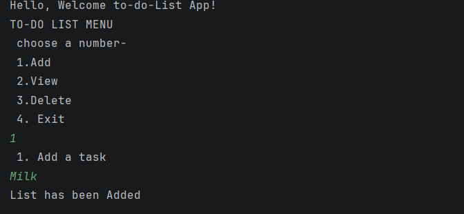
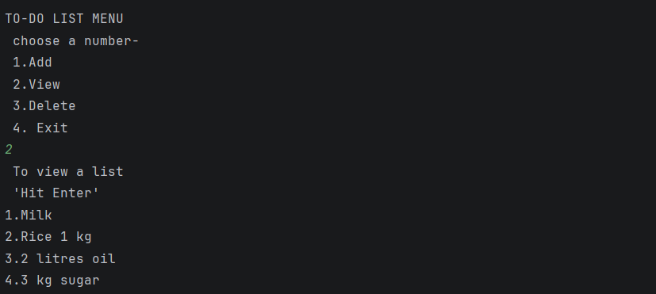
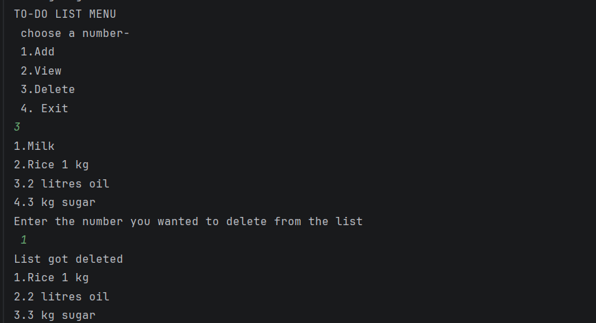
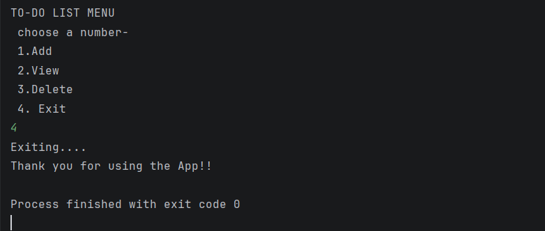

# TO-DO List App

A simple command-line to-do list application built with Python.

## Features
- Add new tasks
- View all tasks with numbers
- Delete tasks by number
- Input validation and error handling

## How to Run
1. Make sure Python is installed
2. Download the file `todo.py`
3. Open terminal/command prompt
4. Run: `python todo.py`

## Usage
1. Choose from the menu:
   - Press 1 to Add a task
   - Press 2 to View tasks
   - Press 3 to Delete a task
   - Press 4 to Exit

## Technologies
- Python 3.14.3

## Author
- Apsar Shaik

## Screenshot
Welcome to Menu & Add a list output:

View a list working output:

Delete an item from the list output:

Exit from the Menu

Thank you happy Learning....
